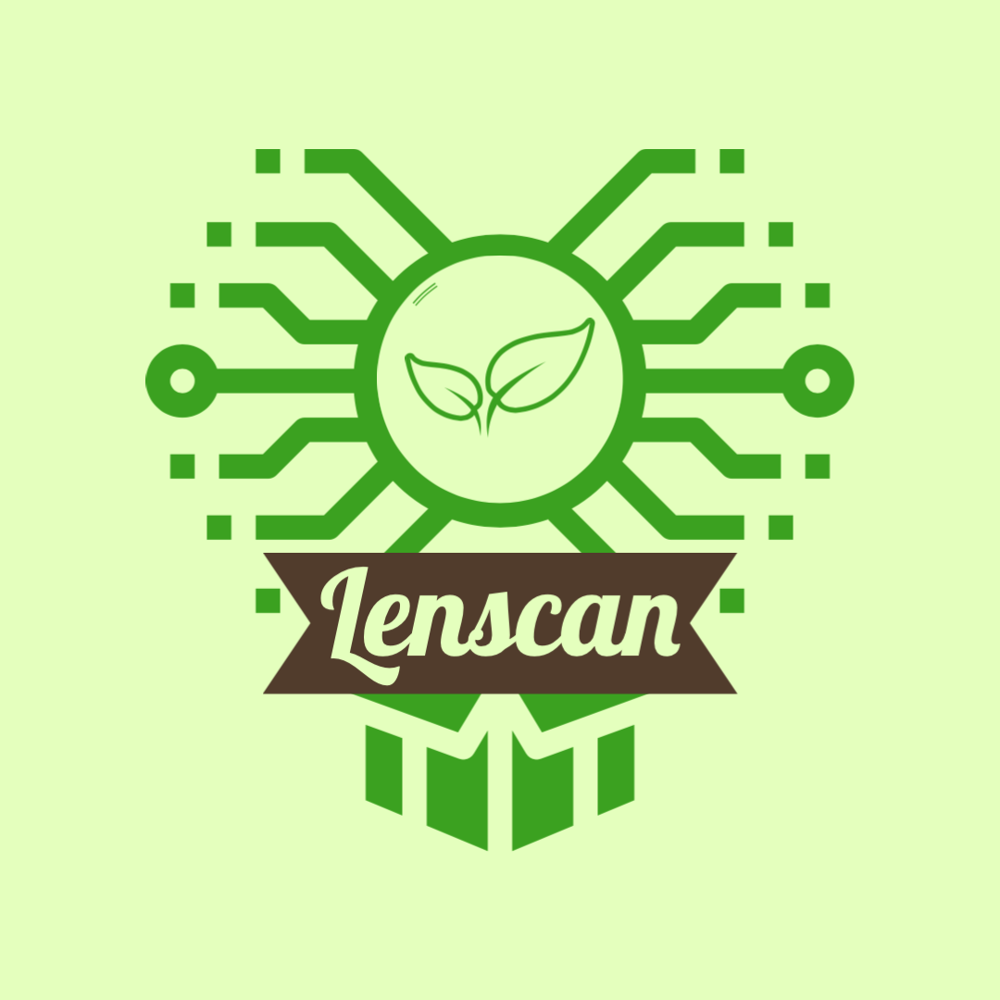
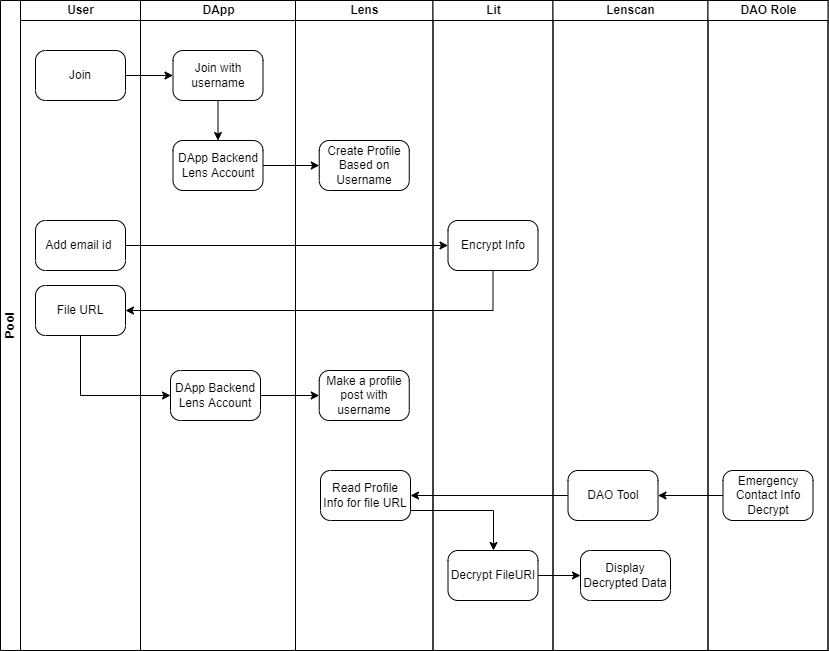

# Lenscan

An etherscan for lens protocol. Developed for the ETH Global Lens Hackathon in Q1 2022.

 

## Features
1. DAO tooling box
2. Lit Integration example for DAO toolbox
3. Graph to see followers

## Workflow 

 
